# Sayram

Sayram is a C++ computational code for solving three-dimensional radiation belt diffusion equations using a positivity-preserving finite volume method on structured meshes. By default, the program numerically solves the diffusion equation in the $(\alpha_0, \log E, L)$ coordinate system. However, users can change the code to use any coordinates of their choice.

## Install

### Prerequisites

Sayram requires the following open-source libraries:
- [Eigen](https://eigen.tuxfamily.org)
- [xtensor](https://github.com/xtensor-stack/xtensor)
- [xtensor-io](https://github.com/xtensor-stack/xtensor-io)
- [xtl](https://github.com/xtensor-stack/xtl)
- [HDF5](https://www.hdfgroup.org/solutions/hdf5/)
- [HighFive](https://bluebrain.github.io/HighFive/)

One easy approach would be to simply add these libraries to the `source` folder of Sayram,  except the HDF5 library, which will be introduced in the following section.

### Notes for Windows Configuration

We developed and tested the Sayram code on Linux and Mac. For Windows, we recommend the following configure development tools:

- [MinGW-w64](https://www.mingw-w64.org) (GCC 9.3+)
- [MSYS2](https://www.msys2.org)
- [Visual Studio](https://visualstudio.microsoft.com) (MSVC 2019+)

## Program Structure

### Directory Hierarchy

```mermaid
graph LR
    A[📁 sayram] --> B[📁 D]
    A --> C[📁 plot]
    A --> K[📁 output]
    A --> D[📁 source]
    A --> E[📄 Makefile]
    A --> F["📄 p.ini<br>📄 radial.ini<br>"]

    D --> G[📁 Cases]
    D --> H["📄 main.cc<br>📄 Solver.cc<br>📄 Equation.cc<br>..."]

    C --> J["📄 cmp_ay.py<br>📄 cmp_Radial.py<br>"]

```



The solver and computational components of Sayram are implemented within the source folder. Sayram has a modular design, so that it can be easily adapted to handle different cases. Case-specific configurations are put in the `Cases` subfolder. Input data, mainly the diffusion coefficients, is stored in the `D` directory. Visualization and result analysis are done by Python scripts located in the `plot` folder. The root directory, `sayram`, contains these folders along with the `Makefile` and configuration files. The default configuration file is `p.ini`.

### Class Inheritance

The `Equation` class serves as a virtual base class, defining fundamental declarations and virtual methods. This is how we handle different cases, such as 1D radial diffusion problems, 2D local wave particle interaction problems, and 3D storm-time radiation belt evolution problems. The inheritance hierarchy within Sayram is illustrated in the following diagram:


Case-specific classes inherit from the `Equation` base class. During program initialization, Sayram performs the following sequence of operations:

1. **Parameter Loading**:
Reads configuration parameters from the `.ini` file, following the structure defined in the `Parameter` class.

2. **Data Input**:
Invokes the case-specific io class to load input data from HDF5 files stored in the `D` directory.

3. **Data Processing**:
Performs initial data preprocessing within the respective case class.

4. **Numerical Computation**:
Executes the numerical solver through the `Solver` class.

5. **Result Export**:
Writes the final output to the `output` folder.


## Makefile Configuration


If the libraries are located in a custom directory (specified by `PATH`), update the `LOCAL_INCLUDE` variable in the Makefile to reflect this path. Note that the HDF5 library requires special handling: ensure that both `HDF5_INCLUDE` and `HDF5_LIB` point to the correct include and library directories, respectively, after installing the HDF5 package.

## Compilation

After the installation, you may generate the executable file (sayram) using

``` bash
# Clean previous build
make clean

# Compile executable
make

# Execute with default configuration
./sayram
```

The default input parameter file is "p.ini".

## Numerical Methodology

Sayram is used to solve the 3D diffusion equation in the form

$$
\frac{\partial f}{\partial t} = \sum_{i,j}\frac{1}{G}\frac{\partial}{\partial Q_i}(GD_{Q_iQ_j}\frac{\partial f}{\partial Q_j}) - \frac{f}{\tau},
$$

which can be used to describe the relativistic electron flux in Earth’s outer radiation belt. The numerical implementation utilizes the 3D Positivity-Preserving Finite Volume (PPFV) method by [Yang](https://onlinelibrary.wiley.com/doi/10.1002/fld.5088), which guarantees:
- Solution positivity preservation
- Unconditional stability independent of CFL constraints

## The Default Case (Albert-Young 2005)
The default case is a 2D problem in *Albert and Young*, GRL, 2005. This 2D problem has a Dirichet boundary condition at the minimum pitch angle (the loss cone angle == 5 degrees). In the paper of Sayram, we modified the Sayram code to handle this boundary condition in alpha.

However, to avoid changing too much code of in the github repo, we use the default setting of Sayram; i.e., the boundary condition in equatorial pitch angle is the zero flux condition (Neumann type), and the pitch angle range is from 0 to 90 degrees. The consequence is that the comparison between Sayram results and Albert-Young is not as good as the one shown in the paper, due to different boundary conditions.

## Implement a New Case

As described in the Introduction, diffusion coefficients are stored in the `D` directory, while case configurations and parameters are organized in separate `.ini` files. For example, to switch to the radial diffusion case, modify `main.cc` as follows:

```C++
  // Create diffusion coefficients object
  // Albert_Young eq(paras, m);
  // Storm eq(paras, m);
  Radial eq(paras, m);
```

to instantiate the equation object (eq) as a Radial type. This case has Neumann boundary (zero-flux) conditions also in E directions. So one needs to comment the following lines in `Solver.cc`.

```C++
// j == 0: handle dirbc
j = 0;
for (i=0; i<m.nx(); ++i)
  for (k=0; k<m.nz(); ++k)
    update_coeff_dirbc({i,j,k}, m.inbr_jm());
```

and

```C++
// j == ny-1: handle dirbc
j = m.ny()-1;
for (i=0; i<m.nx(); ++i)
  for (k=0; k<m.nz(); ++k)
    update_coeff_dirbc({i,j,k}, m.inbr_jp());
```
These lines were designed to handle Dirichlet boundary conditions in E (the default setting of Sayram).

After recompiling the project, execute the following command:

```Bash
./sayram radial.ini
```

If you want to add your own diffusion case, you need to add your diffusion coefficients to the **D** folder in a HDF5 file. Then create the case files in the **source/Cases** folder, following the style of other cases. Then change the **main.cc** to your own case, after cleaning and remaking, run

```C++
./sayram new.ini
```

to use "new.ini" as the input parameter file.

In summary, to implement a custom case, follow these steps:

1. **Data Preparation**:

- Add diffusion coefficients to the `D` directory in the standardized HDF5 format.

2. **Case Implementation**:

- Create case-specific files in `source/Cases/`, following the existing implementation patterns, and define your own equations and boundary conditions.
- Modify the function `assemble` in `Solver.cc` to handle boundary conditions appropriately.
- Develop a new configuration file (e.g., `new.ini`) to specify:

  - Reference paths
  - Mesh density parameters
  - Computational domain boundaries
  - Temporal discretization settings

1. **Code Integration**:

- Modify `main.cc` to initialize your custom case
- Rebuild the project:

```bash
make clean
make
```

4. Execution:
Run the simulation with:

``` bash
./sayram new.ini
```
**Reference**: Consult the default `p.ini` file for detailed parameter specifications and formatting guidelines.

## Supplementary Notes

Sayram supports two fundamental boundary condition types for partial differential equations:

1. **Dirichlet Boundary Condition**: Specifies the solution value at the boundary

2. **Neumann Boundary Condition**: Specifies the derivative of the solution at the boundary

(Note: Robin boundary conditions, being a linear combination of Dirichlet and Neumann conditions, are not explicitly implemented in the current version.)

To configure boundary conditions for custom or modified cases:

1. **Case Implementation**:

- Define boundary conditions in the case-specific implementation files

2. **Solver Configuration**:

- Modify the `assemble` method in `solver.cc` to handle different types of boundaries. Example:

```C++
  // Dirichlet BC implementation at j = 0 boundary
  j = 0;
  for (i=0; i<m.nx(); ++i)
    for (k=0; k<m.nz(); ++k)
      update_coeff_dirbc({i,j,k}, m.inbr_jm());
```

This code sets up the Dirichlet boundary condition at the $\log E_{min}$ boundary. If you apply the zero-flux boundary condition in E, then just comment these lines.

## Contributing to Sayram

If you have any suggestions, please contact Peng Peng at pp140594 "AT" mail.ustc.edu.cn or Xin Tao at xtao "AT" ustc.edu.cn.

## License

The code is open source under the MIT license. If you find it useful or base your research on it, we would appreciate it if you could cite the following paper:

Peng, P., Tao, X., Albert, J. M., & Chan, A. A. (2025). Sayram: A positivity-preserving open source 3D radiation belt modeling code. Journal of Geophysical Research: Space Physics, 130, e2025JA033991. https://doi.org/10.1029/2025JA033991
